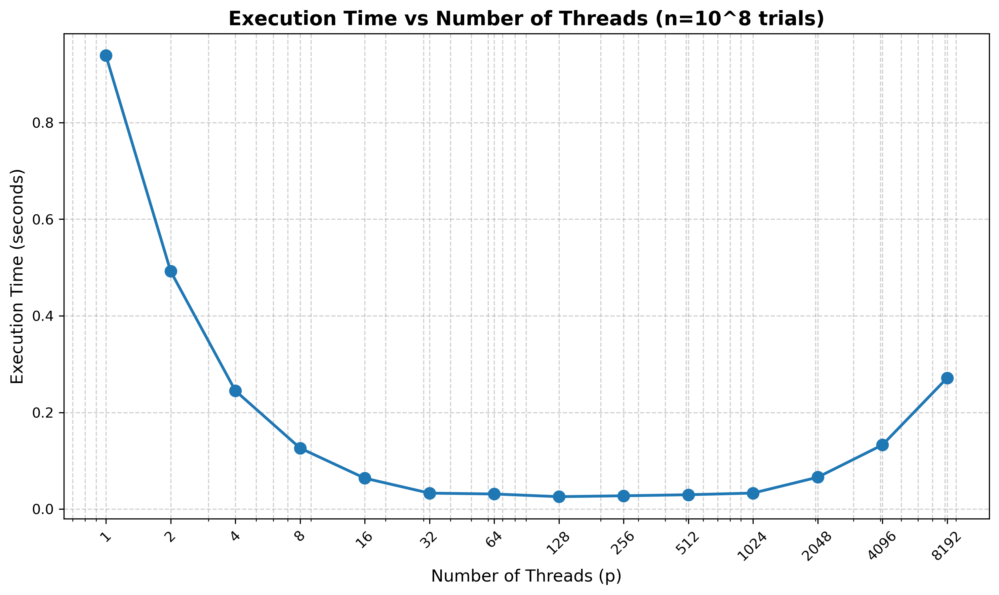
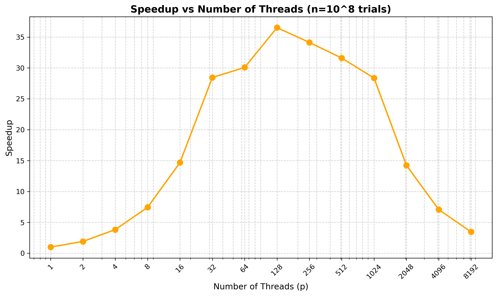
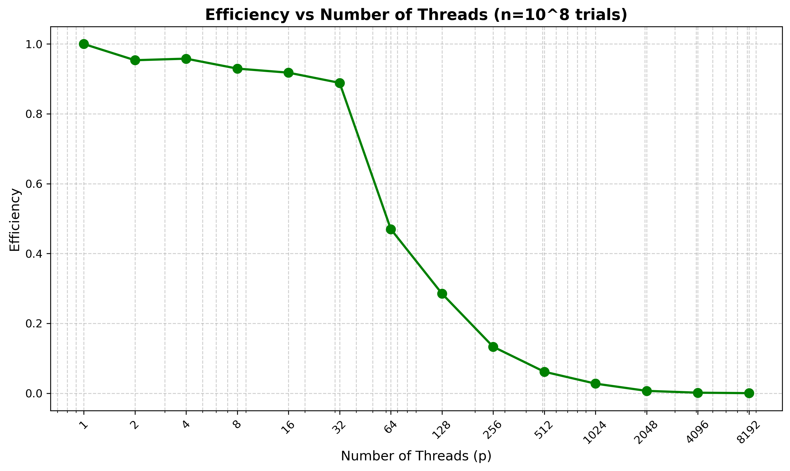
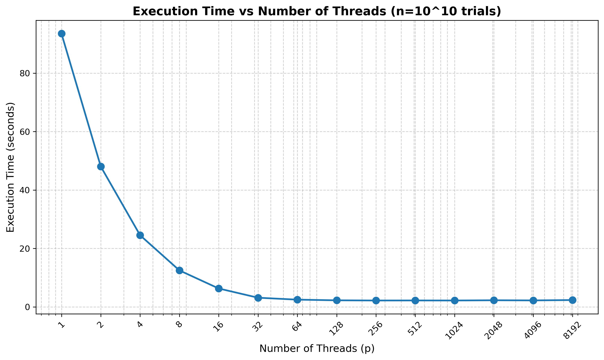
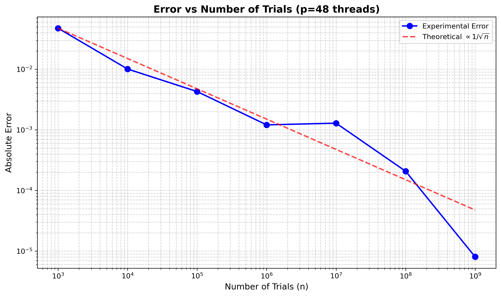

# Part 1: Parallely Calculating PI with Shared-Memory via Threads 

**Number of Trials:** $10^8$

\vspace{0.3cm}

## Question 1.1: Execution Time vs Number of Threads 

{ width=70% } 

The graph demonstrates how execution time varies with the number of threads for $10^8$ Monte Carlo trials. Execution time decreases from 0.94 seconds with a single thread to a minimum of 0.026 seconds at 128 threads, achieving substantial performance gains. Beyond 128 threads, execution time increases due to thread management overhead and synchronization costs exceeding the benefits of parallelization.

\vspace{0.3cm}

## Question 1.2: Speedup vs Number of Threads

{ width=70% }

The speedup curve shows near-linear scaling from 1 to 32 threads, reaching a maximum speedup of 36.52x at 128 threads. After this peak, speedup decreases as the overhead from thread creation, scheduling, and synchronization dominates. This behavior is consistent with Amdahl's Law, where the sequential portion and parallel overhead limit achievable speedup.

\vspace{0.3cm}

## Question 1.3: Efficiency vs Number of Threads 

{ width=70% }

Parallel efficiency (defined as $\text{Efficiency} = \frac{\text{Speedup}}{p}$) remains high (>90%) for up to 32 threads, indicating effective utilization of parallel resources. Beyond this point, efficiency drops sharply, reaching approximately 28.5% at 128 threads and continuing to decline. This trend reflects diminishing returns as thread overhead becomes more significant relative to computational work per thread.

\vspace{0.3cm}

## Question 1.4

**Q:** In your experiments, what value of $p$ minimizes the parallel runtime?

**A:** 128 threads minimizes the parallel runtime at 0.0257 seconds, representing a 36.52x speedup over sequential execution. While higher thread counts are available, they introduce more overhead than performance benefit.

\pagebreak

# Question 2

**Number of Trials:** $10^{10}$

\vspace{0.3cm}

## Question 2.1:  
{ width=70% } 

\vspace{0.3cm}

**Q:** In this case, what value of $p$ minimizes the parallel runtime?

**A:** 256 threads for $10^{10}$ trials resulted in the minimum execution time. 

## Question 2.2:

**Q**: Do you expect the runtime to increase as p is increased beyond a certain value? If so, why? And is this observed in your experiments.

**A**: Yes, although we increased the problem size, eventually, the thread overhead will outgrow the benefit gained from parallelization.  

# Question 3 
**Q**: Do you expect that there would be a difference in the number of threads needed to obtain the minimum execution time for two values of n? Is this observed in your experiments.

**A**: Yes, I would expect the optimal number of threads to increase with the problem size, and this is confirmed by my results. For $10^8$ trials, the optimal thread count was 128, but with $10^{10}$ trials, it increased to 256 threads. 

\vspace{0.3cm}

## Question 4:  

{ width=70% } 

\vspace{0.3cm}

\pagebreak

# Part 2: Parallely Calculating PI via MPI 

