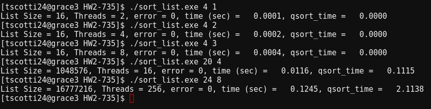
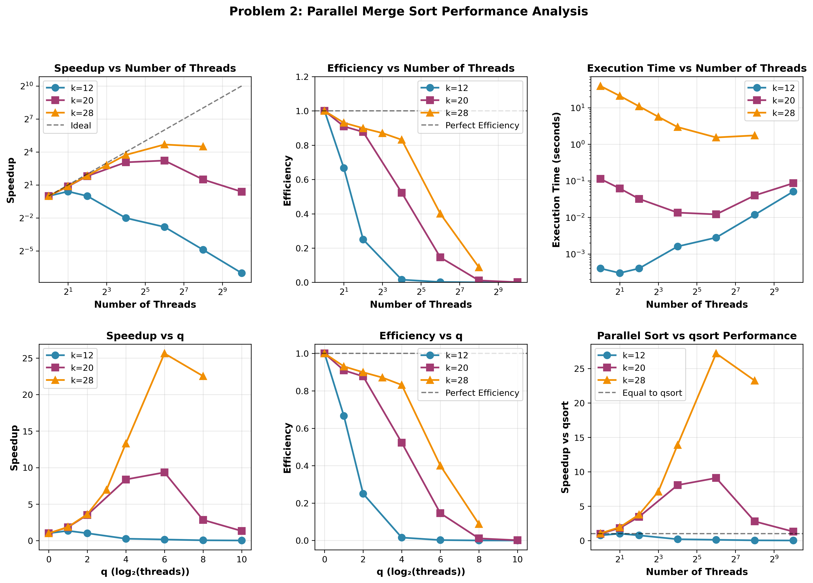
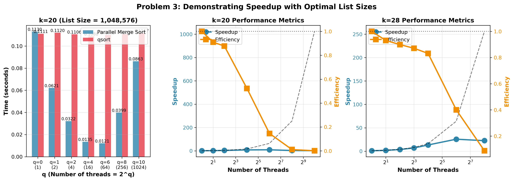

# Question 1: Revising the code to implement a thread-based parallel merge sort. 

\vspace{0.3cm}

{ width=70% } 

# Question 2: Plot Speed up and Efficency  

{ width=70% } 

# Question 3: Speed up  

{ width=70% } 
